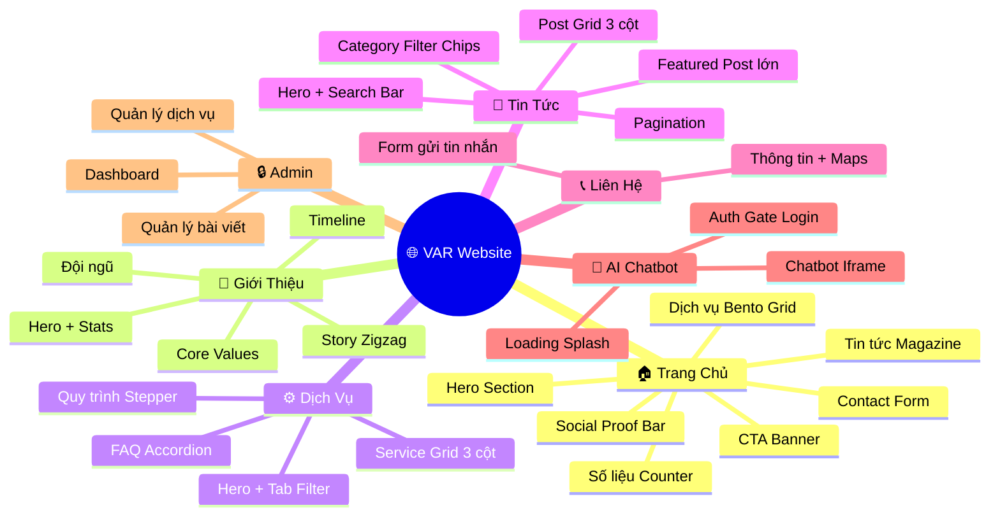
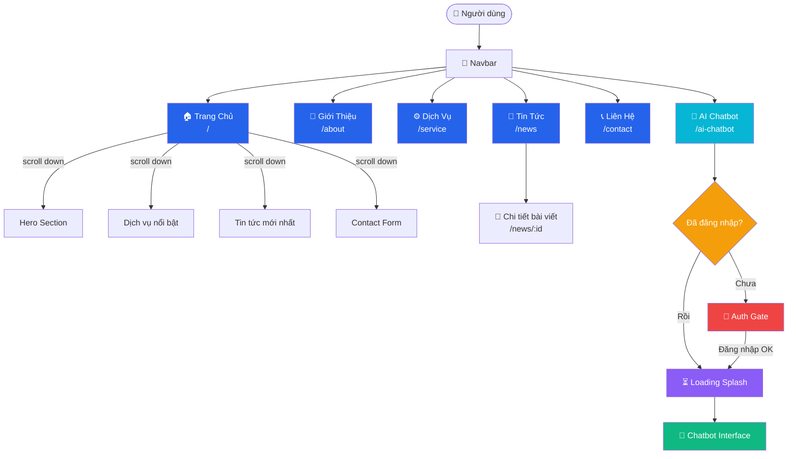
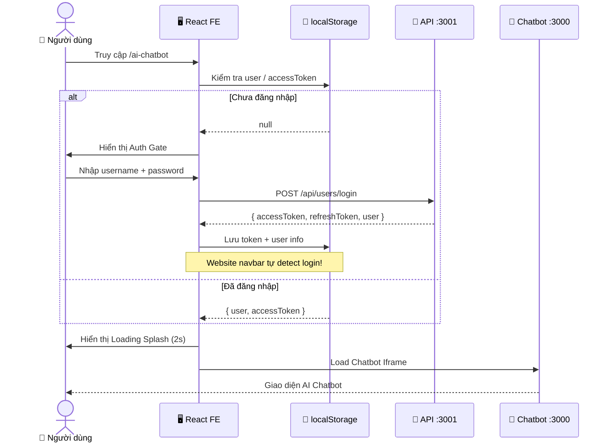
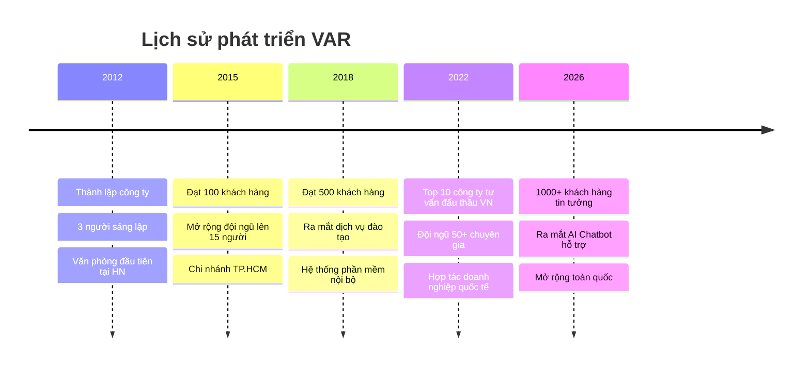
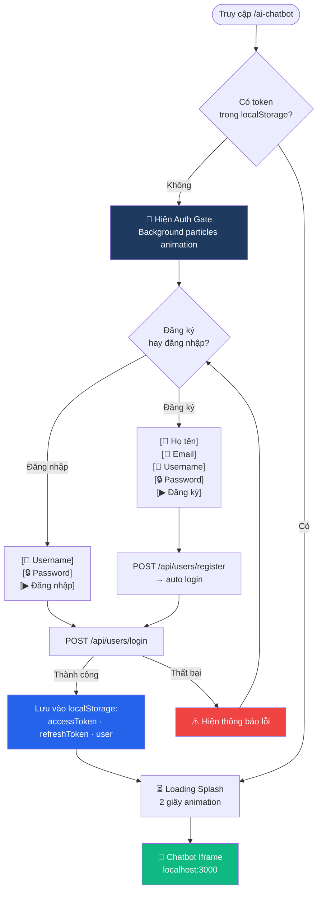
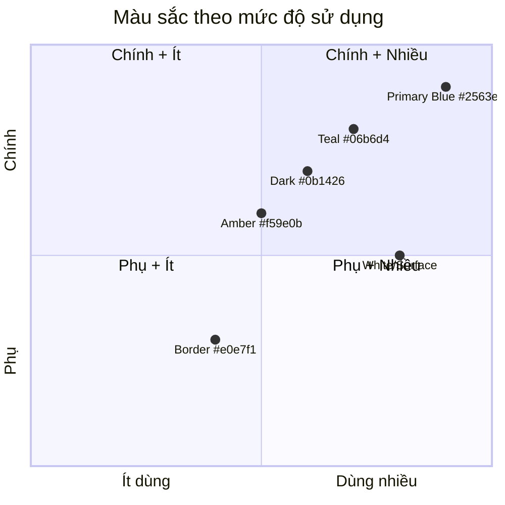
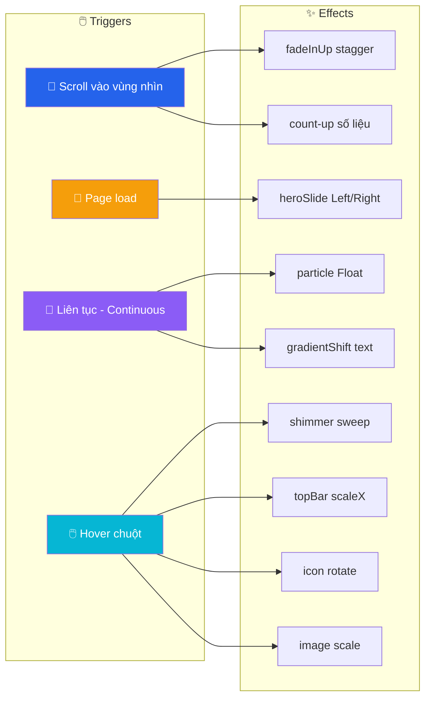
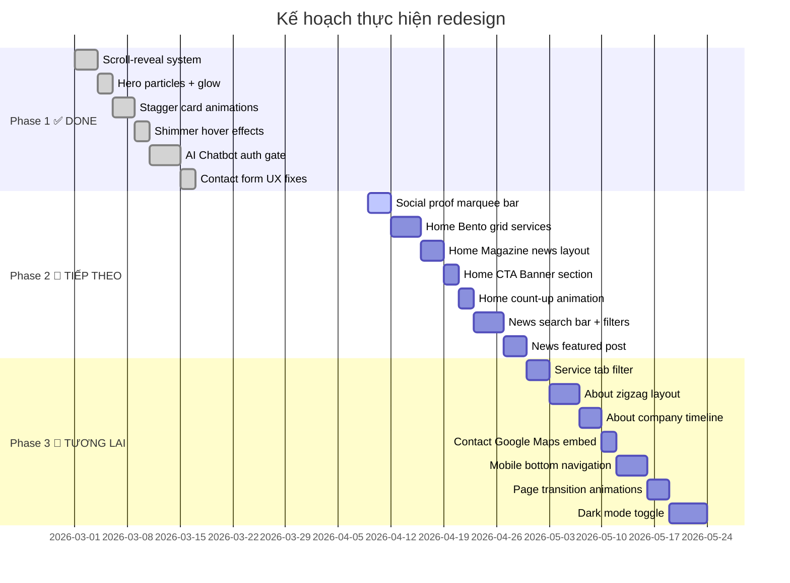
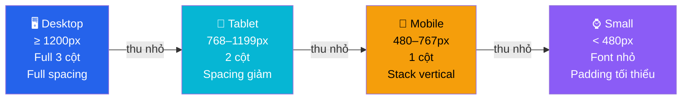

# 🎨 Website Redesign Plan — VAR

> **Stack:** React 19 + Vite 7 · **Design:** Blue-Teal + Amber · **Port:** `localhost:5173`

> 💡 **Mở Markdown Preview:** `Ctrl+Shift+V` → xem đầy đủ sơ đồ màu sắc

---

## 1️⃣ Cấu trúc toàn bộ website



---

## 2️⃣ Navigation Flow — Luồng điều hướng



---

## 3️⃣ Auth Flow — Luồng xác thực AI Chatbot



---

---

## 4️⃣ Trang Chủ — Home Page Layout

### Trước vs Sau

| Hiện tại | Đề xuất |
|----------|---------|
| Service: 3 cột đều | Service: **Bento Grid** (ô to + ô nhỏ xen kẽ) |
| News: 3 cột đều | News: **Magazine** (1 featured lớn + 4 nhỏ) |
| Không có CTA | **CTA Banner** full-width gradient |
| Không có số liệu đếm | **Counter** count-up animation khi scroll |

### Wireframe Layout (từ trên xuống dưới)

```mermaid
block-beta
  columns 1

  block:NAVBAR["🔗 NAVBAR — Logo · Menu · Login"]:1
  end

  block:HERO["🦸 HERO SECTION — 100vh"]:1
    block:LEFT["📝 Nội dung trái (50%)"]
      A["🏷️ Badge: Chuyên gia #1"]
      B["H1: Chuyên gia tư vấn\n& hỗ trợ đấu thầu"]
      C["Mô tả ngắn gọn về dịch vụ..."]
      D["[ 🔥 Khám phá ]  [ 📞 Liên hệ ]"]
      E["320+ Gói · 1000+ KH · 85% Tỷ lệ"]
    end
    block:RIGHT["🖼️ Hình ảnh phải (50%)"]
      F["Hero Image\n+ Glow effect"]
      G["✦ floating: 320+ gói thầu\n✦ floating: 85% trúng thầu"]
    end
  end

  block:BAR["📢 SOCIAL PROOF BAR — Marquee cuộn vô tận"]:1
  end

  block:SVC["⚙️ DỊCH VỤ — Bento Grid"]:1
    block:SVC1["Dịch vụ 1\n(nhỏ)"]
    end
    block:SVC2["Dịch vụ 2 — WIDE\n(rộng gấp đôi)"]
    end
    block:SVC3["Dịch vụ 3\n(nhỏ)"]
    end
    block:SVC4["Dịch vụ 4 — WIDE\n(rộng gấp đôi)"]
    end
    block:SVC5["Dịch vụ 5\n(nhỏ)"]
    end
    block:SVC6["Dịch vụ 6\n(nhỏ)"]
    end
  end

  block:STATS["📊 SỐ LIỆU — 4 counter cards ngang"]:1
    block:S1["320+\nGói thầu"]
    end
    block:S2["1000+\nKhách hàng"]
    end
    block:S3["12+\nNăm kinh nghiệm"]
    end
    block:S4["85%\nTỷ lệ trúng thầu"]
    end
  end

  block:NEWS["📰 TIN TỨC — Magazine Layout"]:1
    block:NF["⭐ Bài viết nổi bật\n(chiếm 50% chiều ngang)\n[ảnh lớn + tiêu đề to]"]
    end
    block:NG["📋 Grid 4 bài nhỏ\n(2x2 bên phải)"]
    end
  end

  block:CTA["✨ CTA BANNER — Full width gradient blue→teal"]:1
  end

  block:CONTACT["📞 CONTACT FORM"]:1
  end

  block:FOOTER["🔗 FOOTER"]:1
  end
```

### Bento Grid chi tiết

```mermaid
block-beta
  columns 3

  block:A["📋 Tư vấn đấu thầu\nicon · tiêu đề · mô tả ngắn\n[→ Xem thêm]"]:1
  end
  block:B["📄 Lập hồ sơ dự thầu — WIDE\nicon · tiêu đề · mô tả DÀI hơn · danh sách tính năng\n[→ Xem thêm]"]:2
  end

  block:C["⚖️ Tư vấn pháp lý — WIDE\nicon · tiêu đề · mô tả DÀI hơn\n[→ Xem thêm]"]:2
  end
  block:D["🎓 Đào tạo\nicon · tiêu đề · mô tả ngắn\n[→ Xem thêm]"]:1
  end
```

### Magazine News chi tiết

```mermaid
block-beta
  columns 3

  block:FEAT["⭐ BÀI NỔI BẬT\n\n[   Ảnh lớn   ]\n\n🏷️ tag  📅 ngày\nTiêu đề lớn nổi bật\nMô tả bài viết dài...\n\n[ Đọc thêm → ]"]:1
  end

  block:SMALL["📋 4 bài viết nhỏ (2×2)"]:2
    block:N2["[img]\n🏷️ tag\nTiêu đề 2\n📅 date"]
    end
    block:N3["[img]\n🏷️ tag\nTiêu đề 3\n📅 date"]
    end
    block:N4["[img]\n🏷️ tag\nTiêu đề 4\n📅 date"]
    end
    block:N5["[img]\n🏷️ tag\nTiêu đề 5\n📅 date"]
    end
  end
```

---

---

## 5️⃣ Trang Dịch Vụ — Service Page

```mermaid
block-beta
  columns 1

  block:H["🎯 HERO — nền tối gradient\n'Dịch vụ của chúng tôi'\nGiải pháp đấu thầu chuyên nghiệp toàn diện"]:1
  end

  block:TABS["🗂️ TAB FILTER\n[ Tất cả ]  [ Tư vấn ]  [ Hồ sơ ]  [ Pháp lý ]  [ Đào tạo ]"]:1
  end

  block:GRID["📦 SERVICE GRID — 3 cột (stagger fadeInUp khi scroll)"]:1
    block:G1["🔷 Tư vấn đấu thầu\nNội dung chi tiết...\n• Tính năng 1\n• Tính năng 2\n[Tìm hiểu thêm]"]
    end
    block:G2["📄 Lập hồ sơ dự thầu\nNội dung chi tiết...\n• Tính năng 1\n• Tính năng 2\n[Tìm hiểu thêm]"]
    end
    block:G3["⚖️ Tư vấn pháp lý\nNội dung chi tiết...\n• Tính năng 1\n• Tính năng 2\n[Tìm hiểu thêm]"]
    end
  end

  block:STEP["🔄 QUY TRÌNH — Horizontal Stepper (hover: nổi lên)"]:1
    block:P1["① 📄\nTiếp nhận\nyêu cầu"]
    end
    block:P2["② 📊\nĐánh giá\nhồ sơ"]
    end
    block:P3["③ ⚙️\nThực hiện\ndịch vụ"]
    end
    block:P4["④ 🤝\nBàn giao\nkết quả"]
    end
  end

  block:FAQ["❓ FAQ ACCORDION\n▼ Quy trình đấu thầu mất bao lâu?\n▼ Chi phí tư vấn như thế nào?\n▼ Có hỗ trợ sau khi trúng thầu không?"]:1
  end
```

---

---

## 6️⃣ Trang Tin Tức — News Page

```mermaid
block-beta
  columns 1

  block:H["📰 HERO + SEARCH BAR\n'Tin Tức & Kiến Thức'\n[ 🔍 Tìm kiếm bài viết... ]"]:1
  end

  block:CAT["🏷️ CATEGORY FILTER CHIPS\n[ Tất cả ]  [ Luật đấu thầu ]  [ Kinh nghiệm ]  [ Hướng dẫn ]  [ Thông báo ]"]:1
  end

  block:FEATURED["⭐ BÀI VIẾT NỔI BẬT — Full width card"]:1
    block:FI["🖼️ Ảnh lớn\n(60% chiều rộng)"]
    end
    block:FC["🏷️ Tag: Luật đấu thầu\n📅 12/04/2026\n\nH2: Tiêu đề bài viết nổi bật\ncỡ chữ to, thu hút\n\nMô tả chi tiết hơn các card thường,\n2-3 dòng giới thiệu nội dung...\n\n[ Đọc ngay → ]"]
    end
  end

  block:GRID["📋 POST GRID — 3 cột (stagger animation khi scroll)"]:1
    block:P1["[🖼️ ảnh]\n🏷️ Tag\nTiêu đề bài 1\nMô tả...\n📅 Ngày đăng\n[Xem thêm]"]
    end
    block:P2["[🖼️ ảnh]\n🏷️ Tag\nTiêu đề bài 2\nMô tả...\n📅 Ngày đăng\n[Xem thêm]"]
    end
    block:P3["[🖼️ ảnh]\n🏷️ Tag\nTiêu đề bài 3\nMô tả...\n📅 Ngày đăng\n[Xem thêm]"]
    end
  end

  block:PAGE["📄 PAGINATION\n◀  1  [ 2 ]  3  4  ▶"]:1
  end
```

---

---

## 7️⃣ Trang Giới Thiệu — About Page

```mermaid
block-beta
  columns 1

  block:HERO["👥 HERO — Về Chúng Tôi\n'Đồng hành cùng doanh nghiệp trên con đường đấu thầu'\n[ 320+ Gói ] [ 1000+ KH ] [ 12 Năm ] [ 85% Tỷ lệ ]"]:1
  end

  block:ZIG1["📖 Câu chuyện thành lập — Zigzag row 1"]:1
    block:IMG1["🖼️ Hình ảnh\ncông ty / đội ngũ"]
    end
    block:TXT1["📖 Câu chuyện thành lập\n\nThành lập năm 2012 với sứ mệnh\nđồng hành cùng doanh nghiệp...\n\nPhát triển từ 3 người sáng lập\nthành đội ngũ 50+ chuyên gia."]
    end
  end

  block:ZIG2["🎯 Tầm nhìn & Sứ mệnh — Zigzag row 2 (đổi chiều)"]:1
    block:TXT2["🎯 Tầm nhìn & Sứ mệnh\n\nTrở thành đối tác tư vấn đấu thầu\nsố 1 tại Việt Nam vào năm 2030.\n\nCam kết mang lại kết quả\ntốt nhất cho mọi khách hàng."]
    end
    block:IMG2["🖼️ Hình ảnh\nvăn phòng / giải thưởng"]
    end
  end

  block:VALUES["🏅 GIÁ TRỊ CỐT LÕI — 3 cột"]:1
    block:V1["🏆 Uy tín\nCam kết minh bạch,\ntrung thực trong\nmọi dịch vụ."]
    end
    block:V2["🔬 Chuyên môn\nĐội ngũ có 12+ năm\nkinh nghiệm trong\nlĩnh vực đấu thầu."]
    end
    block:V3["🤝 Tận tâm\nLuôn đặt lợi ích\ncủa khách hàng\nlên hàng đầu."]
    end
  end

  block:TL["📅 TIMELINE — Lịch sử phát triển\n\n2012 ──●── 2015 ──●── 2018 ──●── 2022 ──●── 2026\nThành lập  100 KH   500 KH  Top 10 VN  1000+ KH"]:1
  end

  block:TEAM["👥 ĐỘI NGŨ CHUYÊN GIA — 4 thành viên"]:1
    block:T1["👤 Avatar\nNguyễn Văn A\nGiám đốc"]
    end
    block:T2["👤 Avatar\nTrần Thị B\nTrưởng phòng"]
    end
    block:T3["👤 Avatar\nLê Văn C\nChuyên gia cao cấp"]
    end
    block:T4["👤 Avatar\nPhạm Thị D\nTư vấn viên"]
    end
  end
```

### Timeline chi tiết



---

---

## 8️⃣ Trang Liên Hệ — Contact Page

```mermaid
block-beta
  columns 1

  block:HERO["📞 HERO — Liên Hệ Với Chúng Tôi"]:1
  end

  block:CONTENT["📋 NỘI DUNG CHÍNH — 2 cột"]:1
    block:INFO["📍 THÔNG TIN LIÊN HỆ\n\n📍 Địa chỉ: 123 Đường ABC,\n   Quận Hoàn Kiếm, Hà Nội\n\n📞 Điện thoại: 0123 456 789\n\n✉️ Email: info@var.vn\n\n🕐 Giờ làm việc:\n   T2–T6: 8:00–17:30\n   T7: 8:00–12:00\n\n[ 🗺️ Google Maps Embed ]"]
    end
    block:FORM["📝 FORM GỬI TIN NHẮN\n\n[ 👤 Họ và tên          ]\n[ ✉️ Email              ]\n[ 📞 Số điện thoại      ]\n[ 📋 Tiêu đề            ]\n[                       ]\n[  Nội dung tin nhắn    ]\n[  (textarea)           ]\n[                       ]\n\n[ 📨 Gửi tin nhắn →    ]"]
    end
  end
```

---

## 9️⃣ AI Chatbot — Auth Gate Flow



---

---

## 🎨 Design System

### Bảng màu



### Bảng màu tham khảo trực quan

| Màu | Preview | Hex | Dùng cho |
|-----|---------|-----|----------|
| **Primary** | 🟦 | `#2563eb` | Buttons chính, links, icons |
| **Teal** | 🩵 | `#06b6d4` | Gradient accent, highlights |
| **Amber** | 🟧 | `#f59e0b` | CTA buttons, badges nổi bật |
| **Dark Navy** | 🟫 | `#0b1426` | Hero backgrounds |
| **Surface** | ⬜ | `#ffffff` | Card backgrounds |
| **Border** | 🔲 | `#e0e7f1` | Viền card, dividers |
| **Error** | 🟥 | `#ef4444` | Thông báo lỗi |
| **Success** | 🟩 | `#10b981` | Thông báo thành công |

### Gradient chính

```css
--grad-primary: linear-gradient(135deg, #2563eb 0%, #06b6d4 100%);
--grad-warm:    linear-gradient(135deg, #f59e0b 0%, #ef4444 100%);
--grad-hero:    linear-gradient(135deg, #0b1426, #1e3a5f, #0d2847);
```

### Typography

| Element | Font | Size | Weight |
|---------|------|------|--------|
| H1 Hero | Montserrat | `clamp(34px, 4.8vw, 60px)` | 800 |
| H2 Section | Montserrat | `clamp(28px, 4.2vw, 46px)` | 800 |
| Body | Inter | `15–17px` | 400 |
| Caption | Inter | `12–13px` | 500–700 |

### Spacing & Radius

| Token | Giá trị | Dùng cho |
|-------|---------|----------|
| `--radius-lg` | `24px` | Card corners |
| `--radius-full` | `9999px` | Buttons, badges |
| Section padding | `100px 40px` | Tất cả sections |
| Grid gap | `28px` | Giữa các card |
| Navbar height | `100px` | Sticky navbar |

---

## ✨ Animation Plan



---

## 📅 Implementation Phases



### Checklist chi tiết

#### ✅ Phase 1 — Đã hoàn thành
- [x] Scroll-reveal `[data-reveal]` toàn trang
- [x] Hero particles + image glow effect
- [x] Stagger animation cho tất cả card grids
- [x] Shimmer sweep on hover
- [x] News card tag badge
- [x] AI Chatbot auth gate (login required)
- [x] Contact form autofill fix
- [x] Contact form border & focus outline fix

#### 🔧 Phase 2 — Tiếp theo (High Impact)
- [ ] **Home:** Social proof marquee bar
- [ ] **Home:** Bento grid cho service cards
- [ ] **Home:** Magazine layout cho news
- [ ] **Home:** Full-width CTA banner
- [ ] **Home:** Count-up animation cho số liệu
- [ ] **News:** Search bar trong hero
- [ ] **News:** Category filter chips
- [ ] **News:** Featured post full-width

#### 🎯 Phase 3 — Tương lai (Polish)
- [ ] **Service:** Tab filter theo danh mục
- [ ] **About:** Zigzag story layout
- [ ] **About:** Company timeline
- [ ] **Contact:** Google Maps embed
- [ ] **Global:** Mobile bottom navigation
- [ ] **Global:** Page transition animations
- [ ] **Global:** Dark mode toggle

---

## 📱 Responsive Design



---

*Tài liệu thiết kế dự án VAR Website · Cập nhật: Tháng 4/2026*
